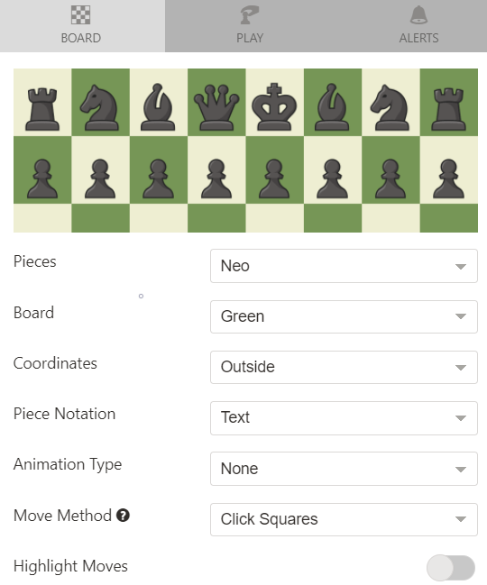
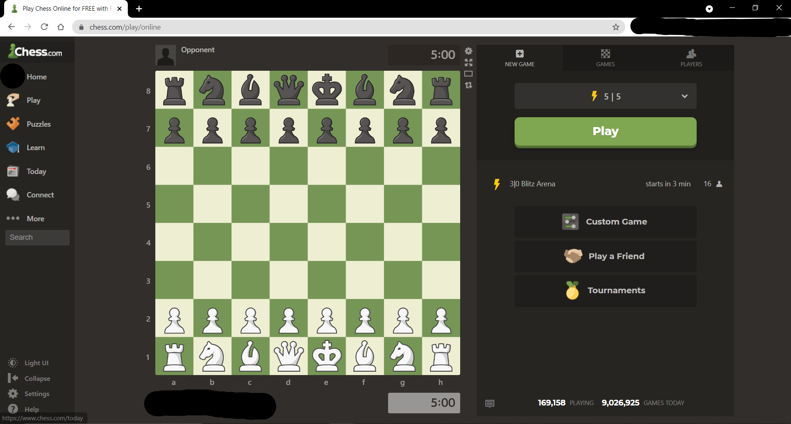

# Computer Vision Assisted Chess Engine Interface for Chess.Com

## Introduction

This project uses python and opencv template matching to convert screenshots of a chess 
board into a FEN string. Then, the FEN string is passed into a chess engine which returns
the optimal move to play in the position.

## Disclaimer

Using a chess engine is against the Chess.com terms of service. I created this project
for learning purposes and not as a means to cheat in online rated chess matches. 
I have been given permission by the Chess.com staff to build and test this project. 
If you wish to test this project, you must do so in an unrated game against a 
user on your friends list. You must also get their written permission to use a
chess engine against them in the Chess.com game chat before the game begins. 
Failure to follow these rules can result in the termination of your Chess.com account.

<br> I do not claim to own any of the files located in the stockfish directory. These files 
are not my own work and are only included to increase the ease of the installation process.

## Installation
* Make sure you have python installed on your machine
* Clone the repository to a directory of your choosing
* Open a terminal window and navigate to the root directory of the project
* Run the command 'pip install -r requirements.txt' to install all the necessary python modules <br>
* If you do not wish to clone the repository with all the stockfish files:
    * Clone the repository from the branch 'without_stockfish'
    * Download your chess engine of choice
    * In line 20 of chess_game.py, replace "stockfish/stockfish" with the path to the chess engine executable:
  ```
      engine = chess.engine.SimpleEngine.popen_uci("stockfish/stockfish")
    ```

## Chess.com Board Setup
For the best results when using this program, there are a few settings you must use for the chess board. <br>
First, make sure that your Chess.com window is opened on your main computer monitor. <br>
Then, copy the following settings under the Chess.com board settings:


## Using the program
* To launch the program, open a terminal and navigate to the root directory of 
the project.
*  From there, run the command 'python gui.py'. This will 
launch a simple gui with three buttons. <br>
* Move the gui so that it does not cover the chess board at all. You may also want to move 
the terminal window to somewhere visible to see print statements. <br>
* Navigate to www.chess.com/play/online and make sure you are logged in to a chess.com account
  * Your window should look something like this:
    

* Click the 'Perform Setup' button to initialize the project.
This may take a few seconds and only needs to be done once each time you run the program.
  * After you run the setup, make sure to not move or resize the chess window, or the program will not work.
* After the setup has completed, you can begin a game of chess. Once you are matched 
against an opponent, click the 'start game' button on the gui to begin getting the optimal chess moves.
  * The program works for playing as both the white and black pieces.
  * At any time, you can click the 'stop game' button to stop communication with the chess engine. 
    You can then start the engine again on a new game.
      * You must always press the 'start game' button from the starting chess position. 
        The only exception to this is when playing as the black pieces, 
        you can start the game after white has made their first move.
* When it is your turn to make a move in the game, the program will output the best move 
  to play to the console as well as text to speech audio output.
* When making moves, do not drag the piece you are moving to the new square. Instead, click 
on the piece you would like to move, and then click on the square you would like to move it to. This is to prevent the 
  image detection from incorrectly reading the board position.
* Instead of running the program on a live game, you can also run the program on a previously completed one
  by stepping through the game move by move using your keyboard's arrow keys.  
  
## Code Walk-through

### Gui.py
 * The entry point of the program
 *  Launches a simple tkinter gui with the buttons: 
      * perform setup
          * Calls a method from the setup.py file which is used to locate the chess board on the user's monitor and creates
            the templates for all the chess pieces
      * start game
          * Calls the 'run' method from game.py as a separate thread to not block the gui thread
          * Begins the main program loop 
      * stop game 
          * Terminates the 'run' method from game.py
  
### Setup.py
* Performs the initialization of the program
* Methods:
    * find_board_dimensions
        * Takes a screenshot of the user's monitor
        * Repeatedly performs opencv template matching with the monitor 
          screenshot and the starting chess board template at different sizes 
            * Used to find the starting x and y coordinate and the size dimensions 
              of the user's chess board on the monitor
                * These values are used when taking all future screenshots to screenshot
                    only the chess board instead of the entire monitor
    * create_piece_screenshots
        * Takes a screenshot of the chess board on the user's monitor
        * Resizes the screenshot so that the width and height is perfectly divisible by 8
            * This allows us to divide the screenshot into an 8x8 grid where each square
                corresponds to a square on the chess board
        * Makes a crop of every unique piece on light and dark squares and saves them in 
          the 'chess_pieces' directory to use in template matching
        * Samples a pixel from the middle of the white queen
            * This is used to determine the color of the pieces the user is playing as at the 
            start of a game

### Screenshot_converter.py
* Contains methods to take a screenshot the chessboard and converts the screenshot into multiple
data structure representations of the chess board position
* Methods:
    * convert_screenshot_to_chess_board_data
        * Builds a 2d array and a dictionary of the chess position by locating each 
          piece using template matching
            * Template matching gives us the pixel coordinate locations of each chess piece 
                which we can use to determine the rank and file of the piece on the chess board
    * convert_array_to_fen
        * Iterates over the 2d array representation of the chess board and builds a
            FEN string of the board position
    * get_player_color
        * Compares a pixel value of the user's queen with the pixel value of the white queen
        to determine what color pieces the user is playing as
          
### Chess_game.py
* Contains the main program loop and methods that build the second half
of the FEN string which is used in the chess engine to find the optimal move to play in the position
 * Methods:
    * run
        * Infinite loop that runs until the stop_game method is called
        * Every iteration of the loop:
            * Takes a screenshot of the chess board
            * Compares the screenshot with the previous screenshot using the Mean Squared Error algorithm
                to determine if the screenshots are different
            * If the difference between the screenshots is too large, then the board
                must be obstructed and we do nothing
            * If the screenshots are slightly different, we update the board position
                * The final board position is stored as a FEN string
                * If the next player to make a move is the user, pass the FEN string into the chess engine which 
                  returns the best move to play in the position

                  
## Chess Terminology and Resources

FEN - https://www.chess.com/terms/fen-chess <br>
Rank - A horizontal row of squares on the chess board <br>
File - https://www.chess.com/terms/chess-file <br>
En Passant - https://www.chess.com/terms/en-passant <br>
Castling - https://support.chess.com/article/266-how-do-i-castle <br>
Queenside Castling (long castling) - Castling with the rook on the A file <br>
Kingside Castling (short castling) - Castling with the rook on the H file


## Future Plans for the project
* Expand and improve the graphical user interface
* Refactoring and code quality improvement  
* Bug fixes